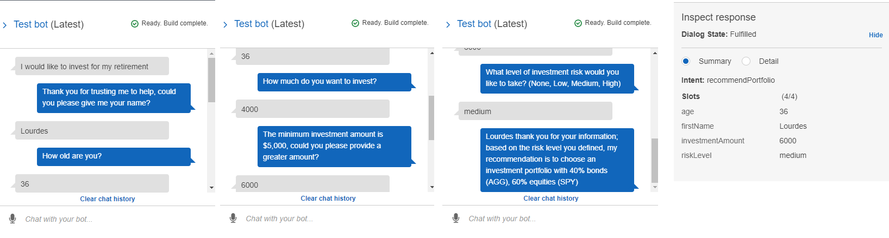

# RoboAdvisor with AWS

This project creates a Roboadvisor using Amazon Lex's features and then enhances it by adding an Amazon Lambda function to give it more functionalities.

For this, we follow these steps:

* **Configuration of the initial robo advisor** in Amazon Lex with a single intent that establishes a conversation about requirements to suggest an investment portfolio for retirement.

* **Building and testing of the robo advisor:** Making sure the bot works and accurately responds during the conversation with the user.

* **Enhancing of the robo advisor** with an Amazon Lambda function that validates the user's input and returns the investment portfolio recommendation. This includes testing the Amazon Lambda function and integrating it with the bot.

The bot will recommend a Portfolio considering the answers provided by the user.

---

## Technologies

The Lambda function code is developed in ```Python```, writen in Jupyter lab.

```Amazon Lex``` is used to build and configure the Bot, and ```Amazon Lambda``` to build and test the function before embedding it into the final bot.

---

## Conclusions

Two **videos** are attached on the project folder showcasing both the initial bot configuration (```bot_test.mp4```) and the one enriched with the Lambda function (```bot_lambda_test.mp4```). 

This is a summarized image of a simple final test:


---

## Contributors

Feature developed by Lourdes Dominguez [(LinkedIn profile)](https://www.linkedin.com/in/lourdes-dominguez-bengoa-12333044/)

---

## License

Use only for academic purposes.